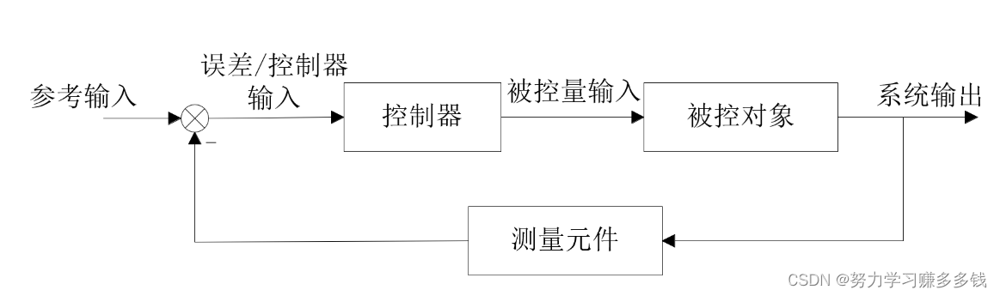
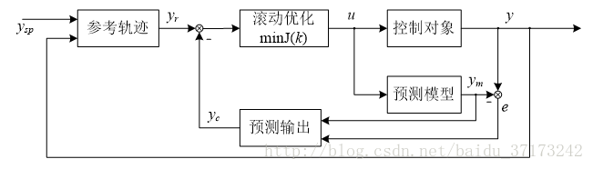

上篇《[时间就是最巨大的谎](https://mp.weixin.qq.com/s/r6ujzcmqR3JMjlhwkatoWA)》中说到，我们不拥有任何时间，我们**只存在于当下**。

那是否意味着我们做什么都无所谓了，反正所有的体验都只在当下？

当然不是，别忘了我们还有活着的意义，追求[心流](https://mp.weixin.qq.com/s/Q9FHkf2r3O1HcaBRAvH9-w)，追求[高复杂度](https://mp.weixin.qq.com/s/2bwbrLCY6nWJpjy84W1-vg)。

当我们有了目标，**如何高效实现目标**就涉及到方法论了。

控制论研究的就是如何让“被控对象”实现目标，是自动化技术和工业革命的理论基础。当然，我们这里不会讨论任何数学公式或推导，但控制论的框架却可以借鉴指导我们的人生。

做控制的主要有两大流派：一种是无模型的，以PID控制为代表，一种是有模型的，以模型预测控制（MPC）为代表。

在无模型的PID控制中，最常见的反馈控制就是**根据设定值(参考输入）和当前状态(测量值)的差（误差），计算出一个动作（系统输入）**。

控制器的设计就是根据被控对象特征，设置3个参数。

这种方法的好处是**简单**，不管什么被控对象，只要调好3个参数就好了，**以不变应万变**。动作的计算还可以考虑历史信息，就像我们的大脑记忆。至今，工业界大部分的控制还是在用PID，因为**足够简单且可靠**。

大多数动物甚至人在大多数时间里的行为模式就很像PID：同样的预期（设定值），同样的刺激（测量值），就产生同样的动作。像是习惯的养成，就是把几个参数调好，形成肌肉或大脑记忆，**节省能量的消耗**。这在大多数情况下也够了，但当我们需要处理高复杂度的事情时，光有PID就不够了。

PID的缺点也是明显的。首先，设定值从哪来？显然，这取决于更高层次的目标。比如空调温度设置成25度，是因为这个温度最舒服。但目标和设定值之间的关系就没有那么直接了。就好像一道菜好不好吃和具体要放多少盐就很难说。

第二，PID控制是一个输出、一个输入，一个参考值这样的结构。如果有多个参考值，就需要多个PID控制器。当多个变量相互影响时，就很难控制了，那真是**按下葫芦起了瓢**了。

第三，PID参数如何调节？虽然有一些理论方法可以借鉴，但一般也只能给一个初始值，再根据具体情况做微调，调的好坏一个是要不停的试，再一个也和师傅的手艺有关。

第四，PID控制器只考虑当下和历史，并**不考虑未来**。而考虑未来，就必然需要一个**关于未来的模型，能对未来进行预测**。

《[时间就是最巨大的谎](https://mp.weixin.qq.com/s/r6ujzcmqR3JMjlhwkatoWA)》里不是说我们**不拥有未来**吗？没错，因为未来还没来，任何事情都有可能发生。而考虑未来则是在头脑中预测未来的可能性，用于指导当前的行为。这也是人类区别动物关键特性之一。

再来说说MPC，可以看出，结构上和PID差不多，就是多了预测模型和滚动优化。其中预测模型可以根据当前的状态，预测出未来一段时间内被控对象的状态。滚动优化则是根据目标，计算出最优的动作序列，然后只采取第一个动作，得到反馈后再重新做预测和计算最优动作序列（所以才叫滚动）。

MPC的控制模式就好像在下棋。高手总是先提前想几步，然后下一步棋，等对手下完后，再提前想几步。我们在处理复杂事物时，也需要**深思熟虑**，尽量想到各种可能性再做决策。所以看上去MPC比PID高级是吧，不过为啥工业界用的反倒还没有PID多呢？主要原因有两个：

第一，**计算量大**，每一步都要预测和计算一串儿的状态和动作，比较烧脑。简单的PID能解决就没必要上MPC，只有比较复杂的情况才有必要用MPC。就好像我们大多数的行为是无意识的，只有重大决策才会做全面分析，甚至群策群力。

第二，需要一个**准确的模型**。显然，模型不准，状态就算不准，动作就会更离谱。现实中我们面对的对象更复杂，人与人的差别就体现在头脑中持有的模型是否准确。

总结说来，这两种控制模式各有优缺点，需要结合具体的场景使用，这对我们的人生有什么启示呢？

1. 要有明确的目标，目标的选择参见前文[《幸福的秘诀》](https://mp.weixin.qq.com/s/Q9FHkf2r3O1HcaBRAvH9-w)和[《高复杂度的意义》](https://mp.weixin.qq.com/s/2bwbrLCY6nWJpjy84W1-vg)。
2. 将目标分解为任务（注意具备这种能力本身也是一个目标）。只有目标，没有任务就好像没有了设定值，无法加以控制。
3. 要有反馈，最好是定量的反馈，没有反馈控制逻辑就无法闭环。
4. 区别任务的复杂度。对于低复杂度的任务，尽量采用PID模式，即内化为习惯、无意识的行为。对于高复杂度的目标，采用MPC模式，深思熟虑，有意识的处理。另外，随着我们能力的提升，曾经的高复杂度也会变为低复杂度，控制模式也会发生变化。
5. 对于PID模式，多试、多练才能调好参，大胆去尝试，直到参数稳定下来。
6. 对于MPC模式，模型是关键。同样需要多尝试来积累经验，也要多学习多借鉴，活到老学到老。我们只有在MPC模式下才能体验到心流，这会是我们一生的修炼。
