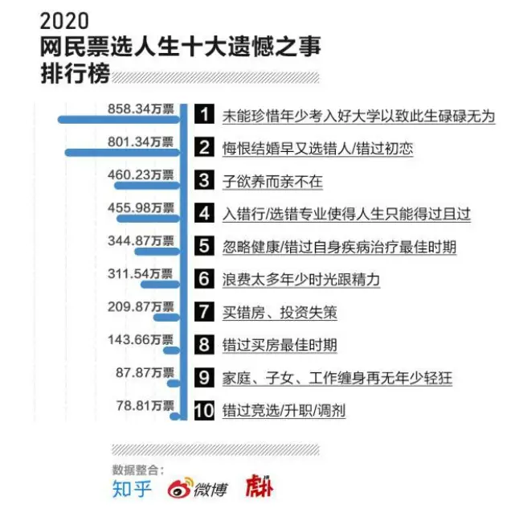
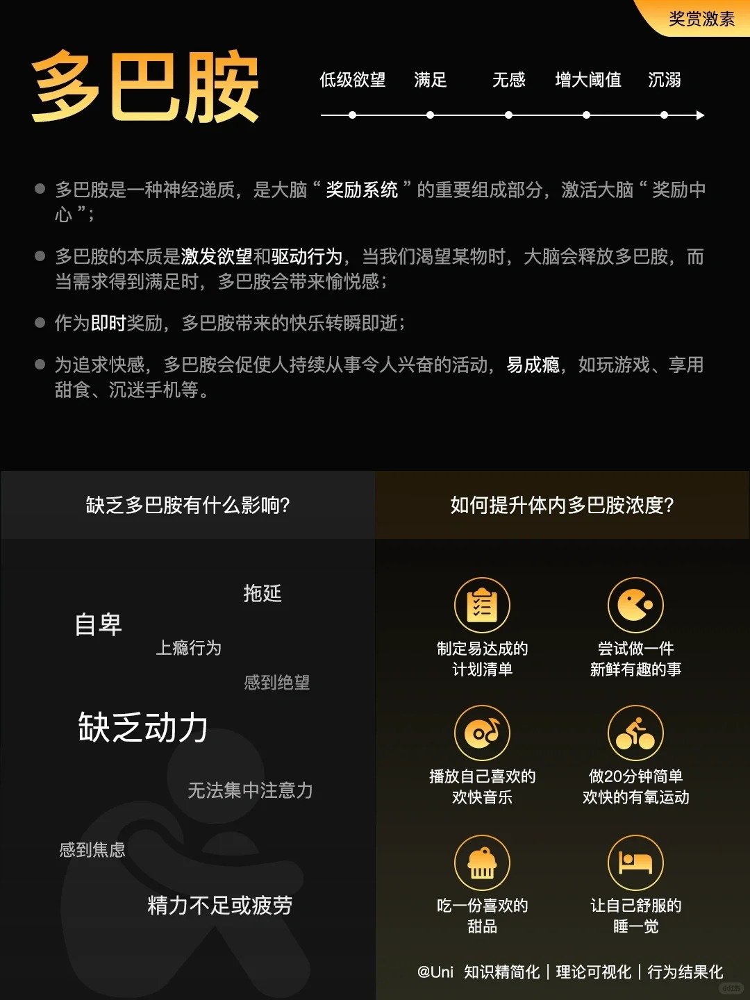
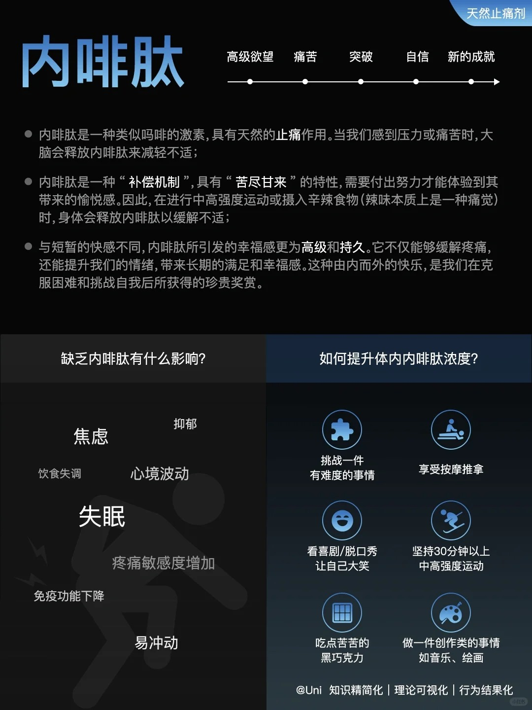
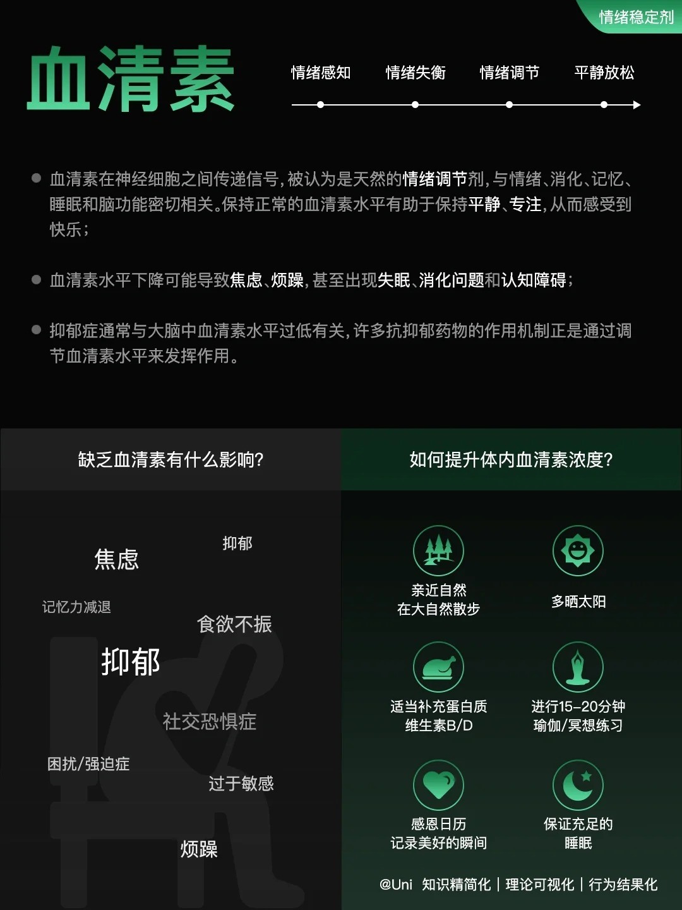
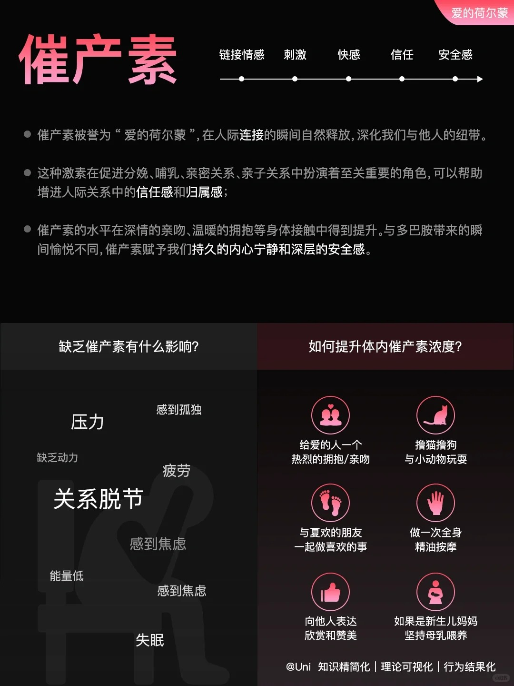

《[时间就是最巨大的谎](https://mp.weixin.qq.com/s/r6ujzcmqR3JMjlhwkatoWA)》中说到，过去对我们来说只存在于记忆中，未来对我们来说只存在于想象中，我们不拥有时间，我们**只存在于当下**。

无论是关于过去的记忆还是关于未来的想象，靠的都是我们的大脑，我思故我在，没有大脑，就没有我们。

大脑是个神奇的器官，比如你还能想起来昨天都吃了什么吗？前天呢？一个星期前呢？大部分都记不起来了吧。这就是我们大脑记忆的方式，**那些不起眼的日子，我们很快就会忘记**。

2020年网民票选人生十大遗憾之首是**此生碌碌无为**，榜单中的大部分遗憾的原因其实就是**被动的对付着生活，结果被生活对付**了。日子过的平平淡淡，以至于想不起来都做过了什么，后悔那些时间要是做些现在看起来有意义的事就好了。

可是，不是说平平淡淡才是真吗？别傻了，**平平淡淡可不是碌碌无为，是与其追求外在的财富、权力、地位，不如追求自身的幸福**。

再看看关于未来的想象，我们总以为当我得到某种财富、权力、名誉的时候，我就幸福了，其实大部分都是虚妄。得不到会痛苦，而得到了除了获得短暂的快乐，等待我们的就是无聊。而[痛苦和无聊本正是我们应该极力避免的东西](https://mp.weixin.qq.com/s/besZFhv5sw11FG7bLsUh-A)。

既然如此，我们要怎么避免遗憾？其实答案很简单，**去做那些能够让你记忆深刻的事情**吧。

回想那些我们记得起来的那些事，是不是往往都伴随着某种情绪？或是高兴、或是痛苦、或是新鲜，总是那些**与平常不一样的事物让我们记忆深刻**。

为什么？因为这和我们大脑的记忆机制有关，简单来说**情绪强烈的记忆往往更深刻**，而情绪则与神经递质的分泌密切相关。

首先是多巴胺（以下图片来源于[小红书](https://www.xiaohongshu.com/explore/65fe8451000000001202370f?source=webshare&xhsshare=pc_web&xsec_token=ABgP9eSDxJi4ZAzm827cjlDZBrX6JH3jlQ_6T_Np3hiMc=&xsec_source=pc_share)）。

多巴胺是我们行动的驱动力，当需求得到满足时，多巴胺会带来愉悦感也是欲望满足得到的奖。然而多巴胺带来的快乐转瞬即逝。

当我们感到压力或痛苦时，大脑会释放内啡肽来减轻不适。是一种“补偿机制”，具有“苦尽甘来”的特性，需要付出努力才能体验到其带来的愉悦感。

与多巴胺带来的短暂快感不同，内啡肽所引发的幸福感更为高级和持久。它不仅能够缓解疼痛，还能提升我们的情绪，带来长期的满足和幸福感。这种由内而外的快乐，是我们在克服困难和挑战自我后所获得的珍贵奖赏。

血清素是天然的情绪调节剂，保持正常的血清素水平有助于保持平静、专注，从而感受到快乐。

催产素在人际连接的瞬间释放，帮助增进人际关系中的信任感和归属感。催产素赋予我们持久的内心宁静和深层的安全感。

以上四种神经递质是我们持久幸福快乐的源泉，如果我们所做的事，能够同时释放这“**四把幸福钥匙**”，记忆必定是深刻持久的了，这件事正是本文的题目：**爱——学——习**。

爱，不管是对人还是对物，就是不计成本的投入。爱人会释放催产素，爱事就会激发欲望，释放多巴胺。

学，就是去接触未知的事物，新鲜感会释放多巴胺，学需要专注，释放血清素。

习，就是练习学到的事物，一样需要专注，释放血清素，并且无论是脑力练习还是体力练习，都会有压力，释放内啡肽。

[心流](https://mp.weixin.qq.com/s/Q9FHkf2r3O1HcaBRAvH9-w)正是一种理想的爱——学——习状态，不会觉得太难而感到痛苦，也不会觉得太简单而感到无聊。

[高复杂度的事物](https://mp.weixin.qq.com/s/2bwbrLCY6nWJpjy84W1-vg)意味着这件事物没有尽头，可以追求一生。

现代教育把学习的范围缩小了，将学习等同于书本知识。实际上世间万物都有其法，都可以去学习，就比如情商这件事就是可以习得的,大道至简就是**爱**这个字。所以说，学习本该是一辈子的事，而不是上完高中或是大学就再也不用学习了。

另一个误区就是将学习功利化。读书无用论就是个伪命题，因为只要学习了，就会得到四把幸福钥匙，那就已经是有用的了。但如果学习只是为了获取金钱地位，那在未达到目的之前，就会忽略掉它本来的功效，实际上就是爱错了对象，学习这件事自然是剩下痛苦了。

还有一个误区是学习需要努力、坚持。学习必然要承受压力，有压力才会成长。因为我们的大脑和身体是反脆弱的系统，适当的压力会让我们变强，而过大的压力则会击垮我们。在心流状态下，压力是可以接受的，也感受不到痛苦。

如果我们感到需要靠意志力去坚持，很有可能就是压力太大，进入了痛苦的区域。所以，虽然从外界看来似乎是在努力、坚持，但当事人其实不应该有这样的感觉。

如果感到痛苦，千万不要硬撑，痛苦的情绪会比幸福的情绪强烈的多，会成为未来学习的阻碍。不妨问一下自己，如果真的爱，那就放轻松，慢慢来，人的一生很长。如果不爱，就去选一个你爱的吧。

爱-学-习，三者相辅相成，分开来讲，每一个都是一种元能力，爱是一种能力，可以去学习，学习也是一种能力，一样可以去学习。能力越大，就可以忍受更多的压力（扩大心流状态的范围），就可以学习更复杂的事物。就好像武侠小说中的内功心法，内力越强招式练得就越快，甚至哪怕只会武当长拳，一样可以称霸武林。

爱-学-习，三者缺一不可。正所谓学而不思则罔，思而不学则殆。学而不习，能力就不会增长，就好像健身时只学会了正确的动作，但不去练习，还是举不起更大的重量。习而不学，当技能水平超过技能复杂度，就会无聊。而没有爱，要么没有驱动力，要么就是为了其他功利的目标学习，都会导致痛苦，自然不能长久。

最后，很喜欢牧大（公众号：之乎者野记）说过的一段话:

> 这世界都是反着的，以放下的心态拿起，以不鸡娃的方式“鸡娃”，以不打骂和说教得方式严格，以出世的态度做入世的事，方才有最好的结果。

**以放下功利的心态拿起学习，以出世的热爱去做入世的事，才有最好的结果。**

什么是最好的结果？那就是我们一生持续的幸福。而有趣的是，当我们足够优秀，财富、权力、地位这些我们本不追求的目标，反而会来找我们，我们可以更主动的去选择是否接受，世界还真是反着来的呢。
